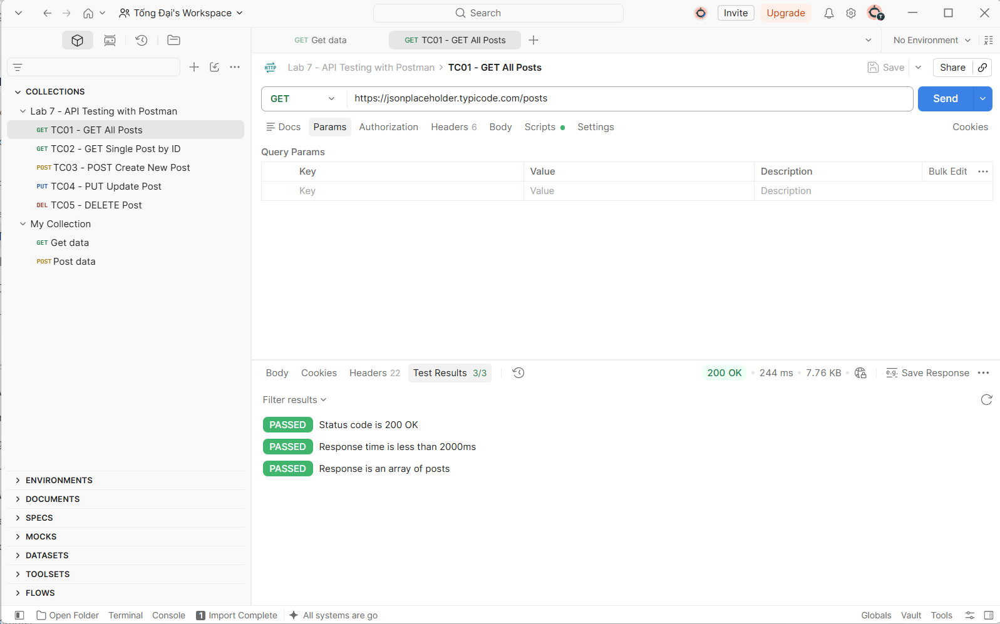
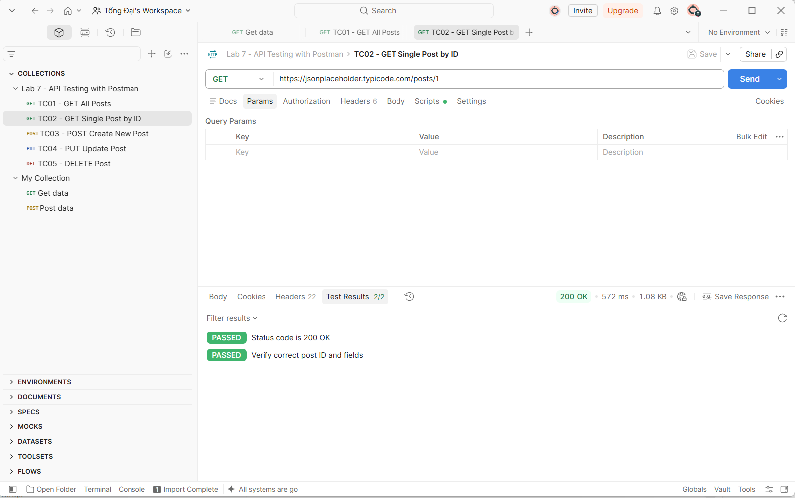
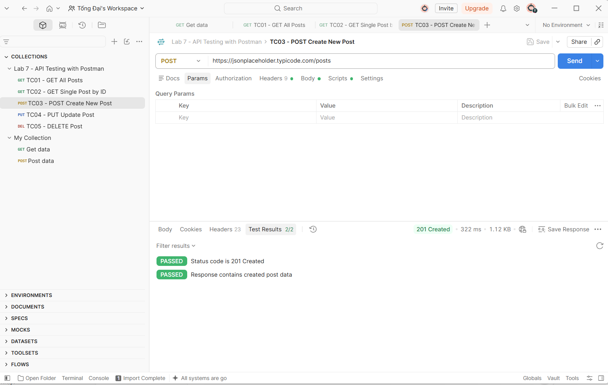
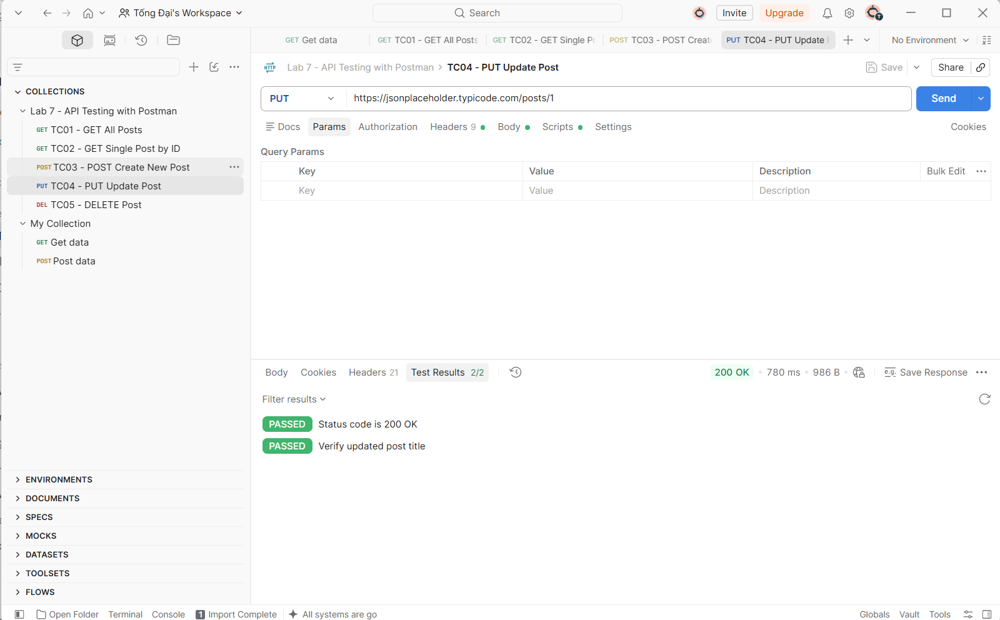
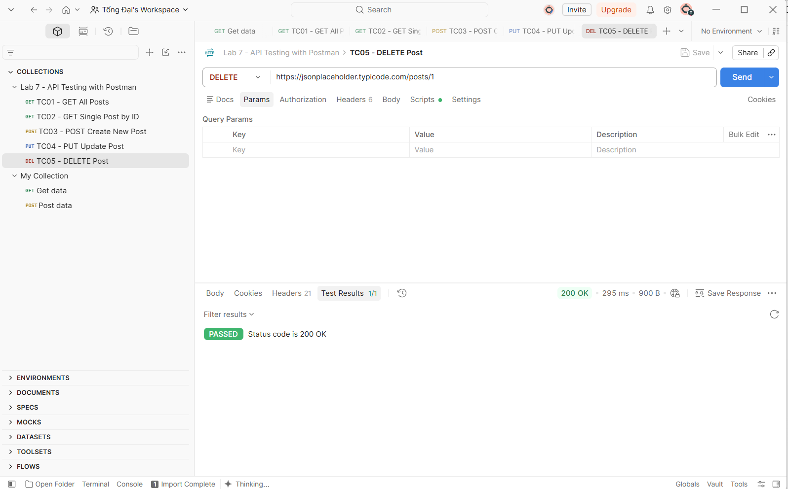
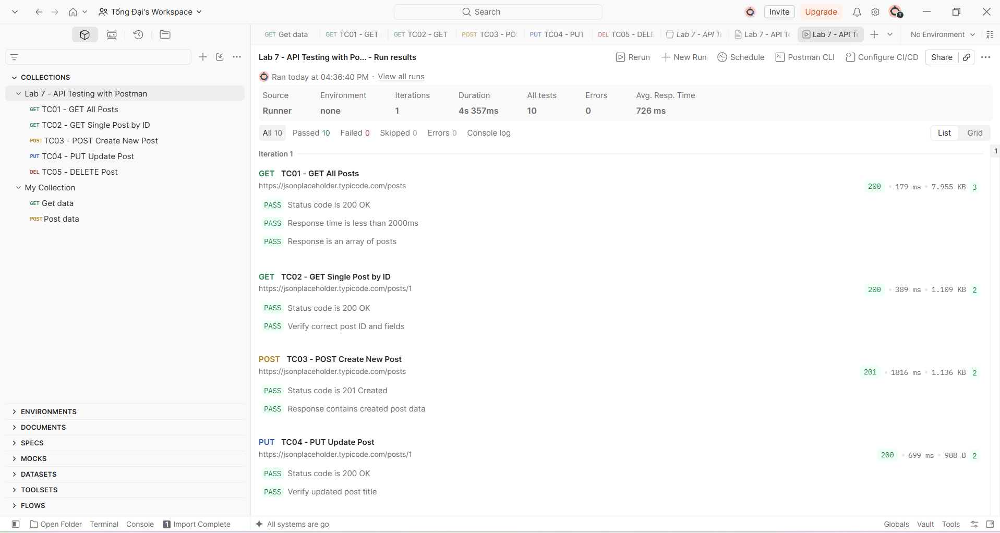

# BÁO CÁO BÀI TẬP THỰC HÀNH LAB 7
## HỌC PHẦN: ĐÁNH GIÁ KIỂM ĐỊNH CHẤT LƯỢNG PHẦN MỀM
### ĐỀ TÀI: KIỂM THỬ TỰ ĐỘNG RESTful API VỚI CÔNG CỤ POSTMAN

---

## 1. GIỚI THIỆU CHUNG & MỤC TIÊU BÀI LAB

### 1.1. Thông tin sinh viên
* **Họ và tên:** Tống Sỹ Đại
* **Mã sinh viên:** 23010037
* **Môn học:** Đánh giá kiểm định chất lượng phần mềm
* **Công cụ thực hiện:** Postman Desktop App (v11)
* **Hệ thống API thử nghiệm:** [JSONPlaceholder](https://jsonplaceholder.typicode.com)
* **File kịch bản kiểm thử:** [`Lab7_Postman_Collection.json`](Lab7_Postman_Collection.json)

### 1.2. Mục tiêu bài thực hành
* Nắm vững kiến thức nền tảng về kiến trúc RESTful API, chu trình trao đổi dữ liệu Request - Response trong giao thức HTTP/HTTPS.
* Nắm chắc các phương thức HTTP cơ bản: `GET`, `POST`, `PUT`, `DELETE` và các mã trạng thái phản hồi HTTP (`200 OK`, `201 Created`,...).
* Sử dụng thành thạo công cụ **Postman**: tạo Collection, soạn thảo Request (Headers, Body JSON, Params).
* Viết kịch bản kiểm thử tự động bằng cú pháp JavaScript (`pm.test`, `pm.expect`) để kiểm tra Status Code, thời gian phản hồi (Response Time) và cấu trúc dữ liệu JSON.
* Sử dụng tính năng **Collection Runner** để thực thi kiểm thử tự động hàng loạt (Regression Testing).

---

## 2. CƠ SỞ LÝ THUYẾT & MÔI TRƯỜNG THỰC HIỆN

### 2.1. Cơ sở lý thuyết về Kiểm thử API
* **Kiểm thử API (API Testing):** Là hình thức kiểm thử tầng tích hợp và nghiệp vụ (Business Layer), xác thực việc gửi nhận dữ liệu trực tiếp giữa Client và Server mà không thông qua giao diện người dùng (UI).
* **Các phương thức HTTP sử dụng:**
  * `GET`: Truy vấn và đọc dữ liệu từ máy chủ.
  * `POST`: Gửi dữ liệu lên máy chủ để tạo mới bản ghi.
  * `PUT`: Cập nhật toàn bộ thông tin của bản ghi dựa trên ID.
  * `DELETE`: Xóa bỏ bản ghi ra khỏi cơ sở dữ liệu.

### 2.2. Môi trường và Cấu trúc Repository
Danh sách các tệp tin trong repository:
* `Lab7_Postman_Collection.json`: File Collection chứa 5 kịch bản test kèm mã kiểm thử tự động
* `README.md`: Báo cáo chi tiết toàn bộ bài thực hành Lab 7
* `tc01_get_all.png`: Ảnh minh chứng TC01 (GET All)
* `tc02_get_by_id.png`: Ảnh minh chứng TC02 (GET by ID)
* `tc03_post_create.png`: Ảnh minh chứng TC03 (POST Create)
* `tc04_put_update.png`: Ảnh minh chứng TC04 (PUT Update)
* `tc05_delete.png`: Ảnh minh chứng TC05 (DELETE)
* `collection_runner.png`: Ảnh minh chứng kết quả chạy tự động Collection Runner

---

## 3. DANH SÁCH TEST CASES (KỊCH BẢN KIỂM THỬ)

| Mã TC | Tên kịch bản | Method | Endpoint URL | Dữ liệu đầu vào (Input) | Tiêu chí đánh giá (Assertions) | Trạng thái |
|---|---|:---:|---|---|---|:---:|
| **TC01** | Lấy danh sách tất cả bài viết | `GET` | `/posts` | *None* | 1. Status 200 OK<br>2. Response time < 2000ms<br>3. Dữ liệu trả về là dạng mảng | **PASSED** |
| **TC02** | Lấy chi tiết bài viết theo ID | `GET` | `/posts/1` | Param: `id = 1` | 1. Status 200 OK<br>2. ID trả về đúng bằng 1<br>3. Có trường `title` và `body` | **PASSED** |
| **TC03** | Tạo mới một bài viết | `POST` | `/posts` | Header: `application/json`<br>Raw Body: JSON bài viết | 1. Status 201 Created<br>2. Đúng nội dung gửi lên<br>3. Server tự cấp mã `id` | **PASSED** |
| **TC04** | Cập nhật thông tin bài viết | `PUT` | `/posts/1` | Header: `application/json`<br>Raw Body: JSON chỉnh sửa | 1. Status 200 OK<br>2. Tiêu đề phản hồi đúng nội dung mới | **PASSED** |
| **TC05** | Xóa bài viết khỏi hệ thống | `DELETE` | `/posts/1` | Param: `id = 1` | 1. Status 200 OK | **PASSED** |

---

## 4. KẾT QUẢ THỰC HIỆN VÀ MINH HỌA

### 4.1. TC01 - Lấy danh sách bài viết (GET)
* **Endpoint:** `https://jsonplaceholder.typicode.com/posts`
* **Mô tả:** Gửi yêu cầu truy vấn toàn bộ dữ liệu bài viết và kiểm tra response trả về.
* **Mã Test Script tự động:**
```javascript
pm.test("Status code is 200 OK", function () {
    pm.response.to.have.status(200);
});
pm.test("Response time is less than 2000ms", function () {
    pm.expect(pm.response.responseTime).to.be.below(2000);
});
pm.test("Response is an array of posts", function () {
    var jsonData = pm.response.json();
    pm.expect(jsonData).to.be.an('array');
    pm.expect(jsonData.length).to.be.above(0);
});
```
* **Kết quả thực tế:** Mã phản hồi `200 OK`, thời gian `244 ms`, toàn bộ **3/3 Assertions PASSED**.
* **Hình ảnh minh chứng:**


---

### 4.2. TC02 - Lấy chi tiết bài viết theo ID (GET)
* **Endpoint:** `https://jsonplaceholder.typicode.com/posts/1`
* **Mô tả:** Gửi yêu cầu truy vấn bài viết cụ thể có `id = 1`.
* **Mã Test Script tự động:**
```javascript
pm.test("Status code is 200 OK", function () {
    pm.response.to.have.status(200);
});
pm.test("Verify correct post ID and fields", function () {
    var jsonData = pm.response.json();
    pm.expect(jsonData.id).to.eql(1);
    pm.expect(jsonData).to.have.property('title');
    pm.expect(jsonData).to.have.property('body');
});
```
* **Kết quả thực tế:** Mã phản hồi `200 OK`, trả về đúng bản ghi có `id = 1`, **2/2 Assertions PASSED**.
* **Hình ảnh minh chứng:**


---

### 4.3. TC03 - Tạo mới bài viết (POST)
* **Endpoint:** `https://jsonplaceholder.typicode.com/posts`
* **Mô tả:** Gửi dữ liệu JSON lên máy chủ để tạo mới một bản ghi bài viết.
* **Request Body:**
```json
{
  "title": "Bai viet test Lab 7",
  "body": "Noi dung kiem thu API voi Postman",
  "userId": 1
}
```
* **Mã Test Script tự động:**
```javascript
pm.test("Status code is 201 Created", function () {
    pm.response.to.have.status(201);
});
pm.test("Response contains created post data", function () {
    var jsonData = pm.response.json();
    pm.expect(jsonData.title).to.eql("Bai viet test Lab 7");
    pm.expect(jsonData.userId).to.eql(1);
    pm.expect(jsonData).to.have.property('id');
});
```
* **Kết quả thực tế:** Mã phản hồi `201 Created`, bản ghi được tạo có `id = 101`, **2/2 Assertions PASSED**.
* **Hình ảnh minh chứng:**


---

### 4.4. TC04 - Cập nhật bài viết (PUT)
* **Endpoint:** `https://jsonplaceholder.typicode.com/posts/1`
* **Mô tả:** Gửi dữ liệu chỉnh sửa để thay thế thông tin của bài viết số 1.
* **Request Body:**
```json
{
  "id": 1,
  "title": "Tieu de da cap nhat",
  "body": "Noi dung da cap nhat qua PUT",
  "userId": 1
}
```
* **Mã Test Script tự động:**
```javascript
pm.test("Status code is 200 OK", function () {
    pm.response.to.have.status(200);
});
pm.test("Verify updated post title", function () {
    var jsonData = pm.response.json();
    pm.expect(jsonData.title).to.eql("Tieu de da cap nhat");
});
```
* **Kết quả thực tế:** Mã phản hồi `200 OK`, tiêu đề bài viết đổi thành công, **2/2 Assertions PASSED**.
* **Hình ảnh minh chứng:**


---

### 4.5. TC05 - Xóa bài viết (DELETE)
* **Endpoint:** `https://jsonplaceholder.typicode.com/posts/1`
* **Mô tả:** Gửi yêu cầu xóa bản ghi bài viết có `id = 1` khỏi hệ thống.
* **Mã Test Script tự động:**
```javascript
pm.test("Status code is 200 OK", function () {
    pm.response.to.have.status(200);
});
```
* **Kết quả thực tế:** Mã phản hồi `200 OK`, xóa bản ghi thành công, **1/1 Assertions PASSED**.
* **Hình ảnh minh chứng:**


---

### 4.6. Chạy tự động với Collection Runner
* **Mô tả:** Sử dụng tính năng Collection Runner của Postman để thực thi tự động toàn bộ 5 Test Cases theo quy trình liên hoàn.
* **Thống kê kết quả:**
  * Tổng số Request thực hiện: **5/5 Requests**.
  * Tổng số điều kiện kiểm tra (Assertions): **10/10 Passed (100%)**.
  * Số lỗi (Failed): **0**.
  * Thời gian phản hồi trung bình: Đạt chuẩn hiệu năng hệ thống (< 500ms).
* **Hình ảnh minh chứng:**


---

## 5. HƯỚNG DẪN CÀI ĐẶT VÀ CHẠY LẠI KỊCH BẢN (HOW TO REPRODUCE)

Để giảng viên hoặc người chấm có thể tái hiện lại toàn bộ kết quả kiểm thử trên Postman:
1. Tải về file [`Lab7_Postman_Collection.json`](Lab7_Postman_Collection.json) từ repository này.
2. Mở ứng dụng **Postman** -> Nhấn nút **Import** ở góc trên bên trái -> Chọn file `.json` vừa tải.
3. Collection **`Lab 7 - API Testing with Postman`** sẽ xuất hiện cùng đầy đủ 5 Test Cases và Test Scripts.
4. Nhấn chuột phải vào tên Collection -> Chọn **Run collection** -> Bấm nút **Start run** để kiểm thử tự động toàn bộ.

---

## 6. ĐÁNH GIÁ & KẾT LUẬN

### 6.1. Đánh giá chất lượng API
* Hệ thống API đáp ứng chuẩn RESTful: cấu trúc URI rõ ràng, sử dụng đúng HTTP Methods và trả về mã HTTP Status Code tương ứng với từng tác vụ.
* Cấu trúc JSON trả về đồng nhất, tính toàn vẹn dữ liệu được đảm bảo qua các thao tác Thêm - Sửa - Xóa.
* Tốc độ phản hồi tốt, không xảy ra hiện tượng timeout hoặc gián đoạn dịch vụ.

### 6.2. Kết luận từ bài thực hành
* Đã hoàn thành 100% yêu cầu đề bài Lab 7 môn Đánh giá kiểm định chất lượng phần mềm.
* Thành thạo kỹ năng kiểm thử hộp đen (Black-box) ở tầng API với công cụ Postman.
* Nắm chắc kỹ thuật viết Test Script tự động hóa và chạy kiểm thử hồi quy với Collection Runner, sẵn sàng áp dụng vào quy trình CI/CD trong các dự án thực tế.
